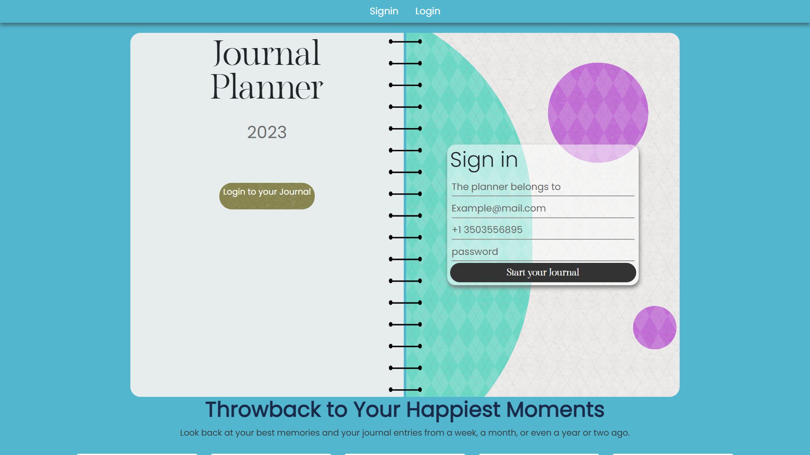

# This is journal webpage 
 
## Journal is an innovative MERN (MongoDB, Express.js, React.js, Node.js) stack project crafted with passion and creativity. Designed to empower users to express their thoughts, emotions, and experiences in a secure and personalized environment, Journal offers a seamless platform for digital storytelling and self-reflection





- [MongoDB](https://www.mongodb.com/)
- [Express.js](https://expressjs.com/)
- [React](https://reactjs.org/)
- [Node.js](https://nodejs.org/)
- [Other libraries or tools]


```bash
# Clone the repository
git clone https://github.com/paul-sourav/your-repo.git

# Change directory
cd your-repo

# Install dependencies
npm install